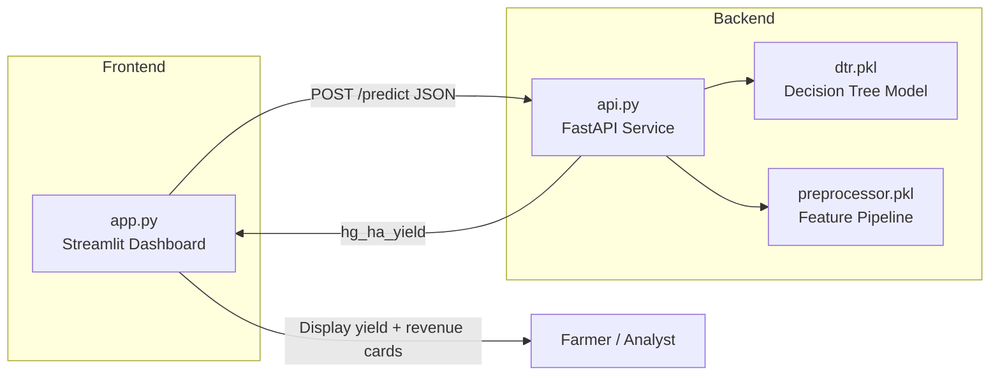

# AgriYield AI — Predictive Harvest Console

**AgriYield AI** is an Agricultural Technology (AgTech) forecasting system that combines a machine-learning yield model with a farmer-friendly web dashboard. Enter field and environmental conditions, and the system projects crop yield and estimated gross revenue per hectare in real time.

At its core, this repository hosts the **AI Agricultural Yield & Revenue Forecasting Engine** — a trained non-linear regression pipeline and FastAPI microservice that ingests historical environmental and regional telemetry and outputs crop production forecasts. The Streamlit console layers localized economic revenue estimates on top of those predictions.

The project is split into two cooperating services:

| Component | File | Role |
|-----------|------|------|
| **ML Microservice** | `api.py` | FastAPI backend that loads the trained model and returns yield predictions |
| **Harvest Console** | `app.py` | Streamlit dashboard for inputs, styling, and revenue estimates |

---

## Table of Contents

- [Architecture](#architecture)
- [Project Structure](#project-structure)
- [Prerequisites](#prerequisites)
- [Installation](#installation)
- [Quick Start](#quick-start)
- [AI / ML Backend (`api.py`)](#ai--ml-backend-apipy)
  - [Training Dataset](#training-dataset)
  - [Preprocessing Pipeline](#preprocessing-pipeline)
  - [Model Performance & Evaluation](#model-performance--evaluation)
  - [Production Model Artifacts](#production-model-artifacts)
- [Streamlit App (`app.py`)](#streamlit-app-apppy)
- [API Reference](#api-reference)
- [Yield & Revenue Calculations](#yield--revenue-calculations)
- [Troubleshooting](#troubleshooting)
- [Optional: Expose API with ngrok](#optional-expose-api-with-ngrok)
- [License & Disclaimer](#license--disclaimer)

---

## Architecture



1. The user enters crop, region, year, rainfall, pesticides, and temperature in the Streamlit app.
2. The app sends a JSON payload to `http://127.0.0.1:8000/predict`.
3. The FastAPI service preprocesses the input, runs inference with the pickled model, and returns predicted yield in **hectograms per hectare** (`hg/ha`).
4. The dashboard converts that value to **metric tons per hectare** and estimates **USD revenue per hectare** using a commodity price index.

---

## Project Structure

```
AI Project/
├── api.py              # FastAPI ML inference microservice
├── app.py              # Streamlit predictive harvest console (UI)
├── dtr.pkl             # Trained decision tree regressor (required by api.py)
├── preprocessor.pkl    # Fitted sklearn ColumnTransformer pipeline (required by api.py)
├── ngrok.yml           # Optional ngrok tunnel configuration
├── requirements.txt    # Python package dependencies
└── README.md           # This file
```

> **Note:** `dtr.pkl` and `preprocessor.pkl` must be present in the project root. They are loaded at API startup. If they are missing, the service will start but predictions will fail.

---

## Prerequisites

- **Python 3.10+** (3.11 or 3.12 recommended)
- **pip** package manager
- Trained model artifacts: `dtr.pkl` and `preprocessor.pkl`

---

## Installation

1. **Clone or open the project folder**

2. **Create a virtual environment (recommended)**

   ```bash
   python -m venv venv

   # Windows
   venv\Scripts\activate

   # macOS / Linux
   source venv/bin/activate
   ```

3. **Install dependencies**

   ```bash
   pip install -r requirements.txt
   ```

   | Package | Used by | Purpose |
   |---------|---------|---------|
   | `fastapi` | `api.py` | REST API framework |
   | `uvicorn` | `api.py` | ASGI server |
   | `pandas` | `api.py` | Input DataFrame for the preprocessor |
   | `pydantic` | `api.py` | Request validation |
   | `scikit-learn` | `api.py` | Required to load pickled model & preprocessor |
   | `streamlit` | `app.py` | Interactive web UI |
   | `requests` | `app.py` | HTTP client to call the API |

4. **Verify model files exist**

   Ensure `dtr.pkl` and `preprocessor.pkl` are in the same directory as `api.py`.

---

## Quick Start

Run **both** services in separate terminals. The API must be running before you click **Compute Harvest Analysis** in the dashboard.

### Terminal 1 — Start the ML backend

```bash
uvicorn api:app --reload --host 127.0.0.1 --port 8000
```

- API base URL: `http://127.0.0.1:8000`
- Interactive docs (Swagger): `http://127.0.0.1:8000/docs`
- Health check: visit `http://127.0.0.1:8000/docs` in your browser

### Terminal 2 — Start the Streamlit dashboard

```bash
streamlit run app.py
```

- Default UI URL: `http://localhost:8501`
- The browser should open automatically

---

## AI / ML Backend (`api.py`)

### Overview

The ML backend is the **AI Agricultural Yield & Revenue Forecasting Engine** — the core predictive pipeline and microservice architecture for this project. It utilizes a trained **non-linear regression model** (Decision Tree Regressor) to ingest environmental and regional telemetry and output highly accurate crop production forecasts.

The service is exposed as a lightweight **FastAPI** microservice titled **AgriYield Cloud MLOps API**. At startup it loads:

| Artifact | Description |
|----------|-------------|
| `dtr.pkl` | Serialized **Decision Tree Regressor** (production model) |
| `preprocessor.pkl` | Fitted **scikit-learn `ColumnTransformer`** feature pipeline |

Revenue forecasting is **not** performed by the ML service itself. The API returns yield only (`hg_ha_yield`); the Streamlit app (`app.py`) applies a commodity price index to derive estimated gross revenue per hectare.

---

### Training Dataset

During model development, a historical agricultural dataset was used containing **28,242 records** spanning multiple countries, crop types, and production years. The data follows a FAOSTAT-style schema aligned with global crop production statistics.

| Attribute | Role | Description |
|-----------|------|-------------|
| `Area` | Feature | Country or region |
| `Item` | Feature | Crop type |
| `Year` | Feature | Production year |
| `average_rain_fall_mm_per_year` | Feature | Annual rainfall (mm) |
| `pesticides_tonnes` | Feature | Pesticide application (metric tonnes) |
| `avg_temp` | Feature | Average temperature (°C) |
| `hg/ha` (yield) | **Target** | Crop yield in **hectograms per hectare** |

The target variable (`hg/ha`) is the quantity predicted at inference time and returned by the API as `hg_ha_yield`.

---

### Preprocessing Pipeline

Raw telemetry cannot be fed directly into the regressor. The `preprocessor.pkl` artifact encapsulates a fitted **`ColumnTransformer`** that applies the same transformations used during training:

1. **Categorical encoding** — `Area` and `Item` are transformed (typically via one-hot or ordinal encoding, depending on how the pipeline was fit).
2. **Numerical scaling** — `Year`, `average_rain_fall_mm_per_year`, `pesticides_tonnes`, and `avg_temp` are scaled to the ranges seen in training (e.g. standardization or min–max scaling).

At inference time, `api.py` rebuilds a single-row `pandas.DataFrame` with **exact column names** from training, calls `preprocessor.transform()`, and passes the result to `model.predict()`. Any mismatch in column names, dtypes, or unseen categorical values can cause encoding errors or unreliable outputs.

---

### Model Performance & Evaluation

During the model exploration and validation phase, multiple regression algorithms were trained and evaluated on the historical dataset. Models were compared using:

| Metric | Meaning |
|--------|---------|
| **MAE** (Mean Absolute Error) | Average absolute deviation between predicted and actual yield (in `hg/ha` units). Lower is better. |
| **R²** (Coefficient of Determination) | Proportion of variance in yield explained by the model (0–1). Higher is better. |

#### Algorithm comparison

| Machine Learning Model | Mean Absolute Error (MAE) | R² Score (Accuracy) | Status |
|------------------------|---------------------------|---------------------|--------|
| Linear Regression | ~28,391.65 | 0.7476 | Rejected (linear limitations) |
| Lasso Regression | ~28,372.38 | 0.7477 | Rejected |
| Ridge Regression | ~28,346.80 | 0.7478 | Rejected |
| **Decision Tree Regressor** | **~3,956.72** | **0.9771** | **Selected for production** |

#### Conclusion

The **Decision Tree Regressor** significantly outperformed traditional linear variants, achieving an **R² score of 97.7%**. This indicates an excellent capacity to map complex, **non-linear interactions** between:

- **Meteorological trends** — rainfall and temperature patterns that do not scale linearly with yield
- **Chemical applications** — pesticide usage and its interaction with climate and crop type
- **Regional and crop context** — localized combinations of `Area` and `Item`

Linear models (Linear, Lasso, Ridge) clustered around **R² ≈ 0.75** and **MAE ≈ 28,300 hg/ha**, suggesting they could not capture the threshold effects and feature interactions present in real agricultural data. The decision tree's branching structure naturally models these non-linear relationships, which is why it was serialized to `dtr.pkl` for production deployment.

#### Production considerations

- **Strengths:** Strong fit on historical data; fast inference; interpretable splits compared to deep learning for this feature set.
- **Limitations:** Decision trees can overfit rare region–crop combinations; extrapolation beyond training years or climate ranges may be unreliable; revenue is estimated separately in the UI, not by the model.
- **Recommendation:** Periodically retrain on updated FAOSTAT or local field data and re-run the same MAE / R² benchmark before replacing `dtr.pkl`.

---

### Production Model Artifacts

| File | Model / object | Purpose |
|------|----------------|---------|
| `dtr.pkl` | `sklearn.tree.DecisionTreeRegressor` | Yield prediction |
| `preprocessor.pkl` | `sklearn.compose.ColumnTransformer` | Feature encoding & scaling |

Both files must be generated with a **compatible scikit-learn version** (see `requirements.txt`). After retraining, restart uvicorn so the API reloads the new artifacts.

---

### Model input features (inference API)

The model expects six features aligned with FAOSTAT-style agricultural data:

| Field | Type | Description |
|-------|------|-------------|
| `Area` | string | Country or region name (e.g. `"India"`, `"United States"`) |
| `Item` | string | Crop type (e.g. `"Maize"`, `"Wheat"`) |
| `Year` | integer | Target production year |
| `average_rain_fall_mm_per_year` | float | Annual rainfall in millimeters |
| `pesticides_tonnes` | float | Pesticide usage in metric tonnes |
| `avg_temp` | float | Average temperature in °C |

### Inference pipeline

1. **Validate** incoming JSON with a Pydantic `CropInput` model.
2. **Build** a single-row `pandas.DataFrame` with the exact column names the preprocessor was trained on.
3. **Transform** features via `preprocessor.transform()`.
4. **Predict** yield using `model.predict()`.
5. **Return** JSON with `status` and `hg_ha_yield` (hectograms per hectare).

### Supported crops (training vocabulary)

The UI and model are aligned on these crop labels:

- Maize
- Potatoes
- Rice, paddy
- Sorghum
- Soybeans
- Wheat
- Cassava
- Sweet potatoes
- Plantains and others
- Yams

> Region and crop strings must match values seen during model training. Unknown categories may cause encoding errors or unreliable predictions.

### Error handling

- Missing or invalid model files: logged at startup; requests may return HTTP 500.
- Preprocessing or prediction failures: HTTP 500 with a `detail` message in the response body.

### Retraining / replacing the model

To update the AI engine:

1. Prepare the training dataset (same schema: 6 features + `hg/ha` target).
2. Fit a `ColumnTransformer` preprocessor and a `DecisionTreeRegressor` (or re-benchmark alternatives using MAE and R²).
3. Serialize with `pickle.dump()` to `preprocessor.pkl` and `dtr.pkl`.
4. Restart the uvicorn process so the API reloads the artifacts.

**Minimal training sketch (illustrative):**

```python
import pickle
import pandas as pd
from sklearn.compose import ColumnTransformer
from sklearn.preprocessing import OneHotEncoder, StandardScaler
from sklearn.tree import DecisionTreeRegressor
from sklearn.model_selection import train_test_split
from sklearn.metrics import mean_absolute_error, r2_score

df = pd.read_csv("your_training_data.csv")  # 28,242+ rows
X = df[["Area", "Item", "Year", "average_rain_fall_mm_per_year", "pesticides_tonnes", "avg_temp"]]
y = df["hg/ha"]

preprocessor = ColumnTransformer(
    transformers=[
        ("cat", OneHotEncoder(handle_unknown="ignore"), ["Area", "Item"]),
        ("num", StandardScaler(), ["Year", "average_rain_fall_mm_per_year", "pesticides_tonnes", "avg_temp"]),
    ]
)
X_train, X_test, y_train, y_test = train_test_split(X, y, test_size=0.2, random_state=42)

X_train_t = preprocessor.fit_transform(X_train)
model = DecisionTreeRegressor(random_state=42)
model.fit(X_train_t, y_train)

X_test_t = preprocessor.transform(X_test)
preds = model.predict(X_test_t)
print("MAE:", mean_absolute_error(y_test, preds))
print("R²:", r2_score(y_test, preds))

with open("preprocessor.pkl", "wb") as f:
    pickle.dump(preprocessor, f)
with open("dtr.pkl", "wb") as f:
    pickle.dump(model, f)
```

Adjust encoders and hyperparameters to match your original training notebook.

---

## Streamlit App (`app.py`)

### Overview

**AgriYield AI • Predictive Harvest Console** is a single-page, wide-layout dashboard designed for clarity in the field. It avoids heavy data-science jargon and uses farmer-oriented labels such as **Field & Environmental Telemetry** and **Yield Analytics & Revenue Estimates**.

### UI / UX design

| Element | Design choice |
|---------|----------------|
| **Background** | Deep dark slate gradient |
| **Success / yield** | Vibrant matrix green (`#4ade80`) |
| **Revenue** | Soft gold / amber (`#fbbf24`) |
| **Typography** | Crisp white and light slate for high contrast |
| **Layout** | Single page, no sidebar navigation, wide-screen spacing |
| **Inputs** | Two-column glass-style cards |
| **Action** | Centered **🚀 COMPUTE HARVEST ANALYSIS** button |

Custom styling is injected via `st.markdown(..., unsafe_allow_html=True)` in the `inject_custom_styles()` function. CSS targets Streamlit’s DOM classes (`.stApp`, `.stButton`, etc.) and custom wrappers (`.agri-header`, `.metric-card`, `.input-card`).

### Input fields

| UI label | API field | Control |
|----------|-----------|---------|
| Crop Type | `Item` | Dropdown |
| Target Region | `Area` | Dropdown |
| Target Production Year | `Year` | Slider (2000–2035, default 2026) |
| Annual Rainfall (mm) | `average_rain_fall_mm_per_year` | Number input |
| Pesticides Used (metric tonnes) | `pesticides_tonnes` | Number input |
| Average Temperature (°C) | `avg_temp` | Number input |

### Output cards

After a successful API response, two metric cards appear side by side:

1. **Projected Yield** (green) — yield in metric tons per hectare, plus raw `hg/ha` from the model.
2. **Estimated Gross Revenue** (amber) — USD per hectare from yield × commodity price index.

### Connection errors

If the FastAPI service is unreachable, the app shows:

> *System Link Error: Ensure your local AgriYield ML model microservice is actively running.*

Start `uvicorn api:app` before using the dashboard.

### Configuration

To point the UI at a different API host, edit the constant at the top of `app.py`:

```python
API_URL = "http://127.0.0.1:8000/predict"
```

---

## API Reference

### `POST /predict`

**Request headers**

```
Content-Type: application/json
```

**Request body**

```json
{
  "Area": "India",
  "Item": "Wheat",
  "Year": 2026,
  "average_rain_fall_mm_per_year": 850.0,
  "pesticides_tonnes": 1.5,
  "avg_temp": 22.0
}
```

**Success response** `200 OK`

```json
{
  "status": "success",
  "hg_ha_yield": 284512.45
}
```

| Field | Description |
|-------|-------------|
| `status` | Always `"success"` on a valid prediction |
| `hg_ha_yield` | Predicted yield in **hectograms per hectare** |

**Error response** `500 Internal Server Error`

```json
{
  "detail": "Error message describing the failure"
}
```

### Example with `curl`

```bash
curl -X POST "http://127.0.0.1:8000/predict" \
  -H "Content-Type: application/json" \
  -d "{\"Area\":\"Pakistan\",\"Item\":\"Maize\",\"Year\":2026,\"average_rain_fall_mm_per_year\":650,\"pesticides_tonnes\":2.1,\"avg_temp\":24.5}"
```

---

## Yield & Revenue Calculations

These conversions happen in the Streamlit app after the API returns `hg_ha_yield`.

### Yield (hectograms → metric tons per hectare)

The model outputs yield in **hectograms per hectare** (`hg/ha`). One hectogram equals `0.0001` metric tons.

```
metric_tons_per_ha = hg_ha_yield × 0.0001
```

**Example:** `hg_ha_yield = 250,000` → `25.00` metric tons/ha

### Estimated gross revenue (USD per hectare)

Revenue uses a static **commodity price index** (USD per metric ton) defined in `app.py`:

```
revenue_usd_per_ha = metric_tons_per_ha × price_usd_per_ton[crop]
```

| Crop | Index price (USD/ton) |
|------|------------------------|
| Maize | 198 |
| Potatoes | 245 |
| Rice, paddy | 362 |
| Sorghum | 175 |
| Soybeans | 448 |
| Wheat | 285 |
| Cassava | 118 |
| Sweet potatoes | 305 |
| Plantains and others | 410 |
| Yams | 355 |

> Prices are illustrative defaults for dashboard estimates, not live market feeds. Replace `COMMODITY_PRICE_USD_PER_TON` in `app.py` with your own index or API for production use.

---

## Troubleshooting

| Symptom | Likely cause | Fix |
|---------|--------------|-----|
| *System Link Error* in the UI | API not running | Start `uvicorn api:app --reload --host 127.0.0.1 --port 8000` |
| HTTP 500 from `/predict` | Missing `.pkl` files or bad input | Confirm `dtr.pkl` and `preprocessor.pkl` exist; check `/docs` for error `detail` |
| `Error loading pickle objects` in terminal | Wrong path or corrupt pickles | Place valid model files next to `api.py` |
| Unknown crop/region errors | Value not in training data | Use crop and region strings from the supported lists |
| Streamlit not found | Package not installed | `pip install -r requirements.txt` |
| Port 8000 already in use | Another process on 8000 | Stop the other service or change uvicorn `--port` and update `API_URL` in `app.py` |

---

## Optional: Expose API with ngrok

The repo includes `ngrok.yml` for tunneling the local API to the public internet (e.g. demos or remote Streamlit clients).

1. Install [ngrok](https://ngrok.com/) and add your authtoken to `ngrok.yml` (do not commit secrets to public repos).
2. Start the API locally on port 8000.
3. Run ngrok against that port per your ngrok config.

If you expose the API remotely, update `API_URL` in `app.py` to the ngrok HTTPS URL.

---

## License & Disclaimer

This project is intended for educational and decision-support use. Yield forecasts depend entirely on the quality and scope of the training data and model. Reported validation metrics (MAE ~3,957 hg/ha, R² ~0.977) reflect performance on the historical evaluation set used during model selection and may not generalize to all regions, crops, or future climate conditions. Revenue figures use simplified static prices and **do not constitute financial advice**. Always validate predictions against local agronomic expertise and current market conditions.

---

**AgriYield AI** — *Real-time crop intelligence and economic forecasting powered by Machine Learning.*
